# GRK
## Wykład 1
### Cele grafiki komputerowej:
* tworzenie obrazów cyfrowych do oglądania przez człowieka
* przekonanie systemu wzrokowego człowieka, że odbiera obraz rzeczywisty
* wykorzystuje wiele uproszczeń wynikających z konieczności dopasowania się do możliwości sprzętu obliczeniowego i urządzenia wyjściowego

### Przetwarzanie obrazów:
* post-processing
* zmiana rozdzielczości
* zmiana liczby barw/odcieni
* kompresja obrazów
* poprawa jakości obrazu
* segmentacja obrazu
* zmiana treści obrazu

### Grafika 2D:
* na płaszczyźnie figury i operacje na nich
* warstwy uporządkowujące w stos wg malejącej głębokości (grafika 2.5D)
  * edycja i rendering każdej warstwy oddzielnie
  * wyświetlanie warstwy od najdalszej do najbliższej
* brak problemów z oświetleniem

### Grafika 3D:
* obiekty 3D
* uwzględnienie zjawisk optycznych (oświetlenie, teksturowanie, cieniowanie, odbicia, załamanie, cienie rzucane przez obiekty)
* animacja
* fizyka
* rzutowanie
* rendering - generowanie obrazu 3D sceny 3D dla ustalonego obserwatora (rzutowanie, zasłanianie)


### Grafika rastrowa:
* obraz w postaci pikselowej
* brak informacji o poszczególnych obiektach
* zmiana rozdzielczości może powodować utratę jakości obrazu
* duże wymagania pamięciowe

### Grafika wektorowa:
* opis obiektu za pomocą parametrów i sposobu rasteryzacji
* możliwość definiowania i edycji każdego obiektu niezależnie
* rasteryzacja w pożądanej rozdzielczości
* oszczędność pamięci

### Proces generowania obrazu:
1) Modelowanie sceny - matematyczny opis kształtu i parametrów: 
   * geometria
   * materiały
   * animacja
   * oświetlenie
   * położenie obserwatora

2) Rendering - ciąg obliczeń prowadzących do uzyskania obrazu gotowego do wyświetlenia
3) Wyświetlenie obrazu

### Zmiana rozdzielczości obrazu za pomocą *interpolacji liniowej*    
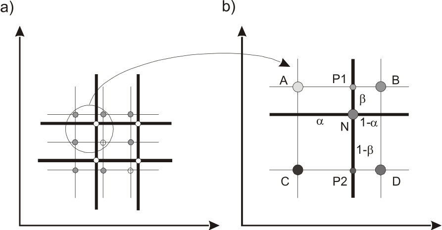  
```
P1 = α B + (1 - α) A
P2 = α D + (1 - α) C
N = β P2 + (1 - β) P1
```

### System wzrokowy człowieka:
Obraz dociera do okra przez soczewkę i trafia na siatkówkę.
* oko, kanał nerwowy, kora mózgowa - interpretacja danych:
  * nieznany mechanizm działania
  * wykrywanie lokalnych zmian (jasność, kolory, częstotliwość)
  * wykrywanie ruchu, kształtu
* siatkówka:
  * prążki - wykrywanie światła przy słabym oświetleniu, odcienie szarości
  * czopki - wykrywanie światła przy mocnym oświetleniu, czułe na barwę
    * duże zagęszczenie w dołku centralnym (na przeciwko soczewki)
    * 3 rodzaje (S, M, L) - czułe odpowiednio na krótkie (niebieskie), średnie (zielone) i długie (czerwone) fale  
    (*stąd podstawowe barwy to RGB*)

### Wyświetlanie obrazu:
* grafika rastrowa:  
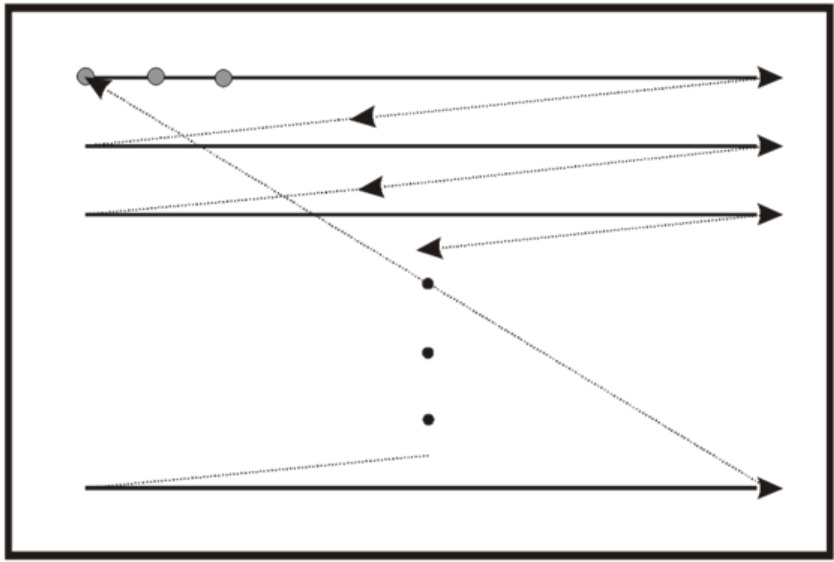  
*wyświetlanie pikseli po kolei, wierszami*
* kolorowanie pikseli:
  * CRT - triady plamek RGB
  * LCD - 3 komórki LCD z filtrami RGB
  * OLED - diody świecące RGB

---

* obraz cyfrowy - skończony zbiór punktów (piksele) o odcieniach szarości lub barwach uporządkowany w postaci matrycy prostokątnej
  * a) reprezentacja węzłowa - piksel jest punktem na przecięciu osi
  * b) reprezentacja powierzchniowa - piksel jest na powierzchni między osiami  
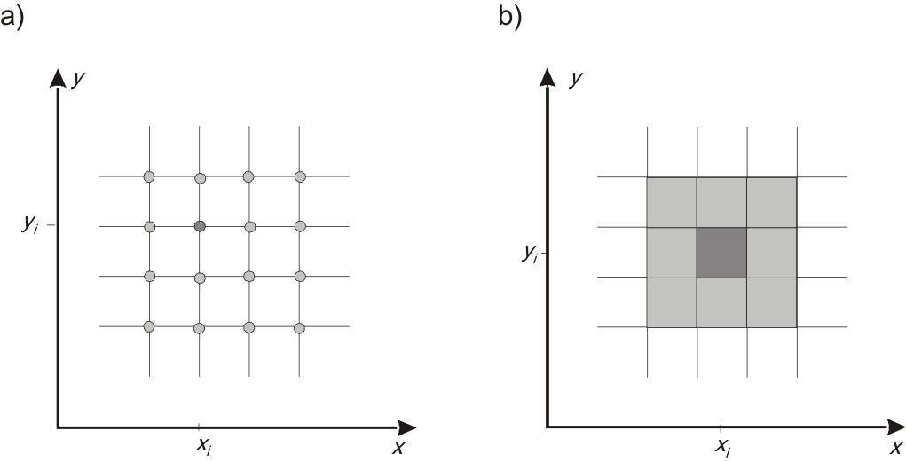
* konwersja obrazu analogowego -> cyfrowy:
  * próbkowanie obrazu (wybieranie punktów)
  * kwantowanie próbek (przybliżenie do barwy cyfrowej dla każdego koloru próbki)
* konwersja obrazu cyfrowego -> analogowy:
  * obraz wyświetlany na monitorze dociera do oka i jest przetwarzany przez system wzrokowy
 * rozdzielczość liniowa - DPI (dots per inch)
 * dynamika jasności - stosunek najjaśniejszego piksela do najciemniejszego
 * podwójny bufor pamięci (*metoda ping-pong*):  
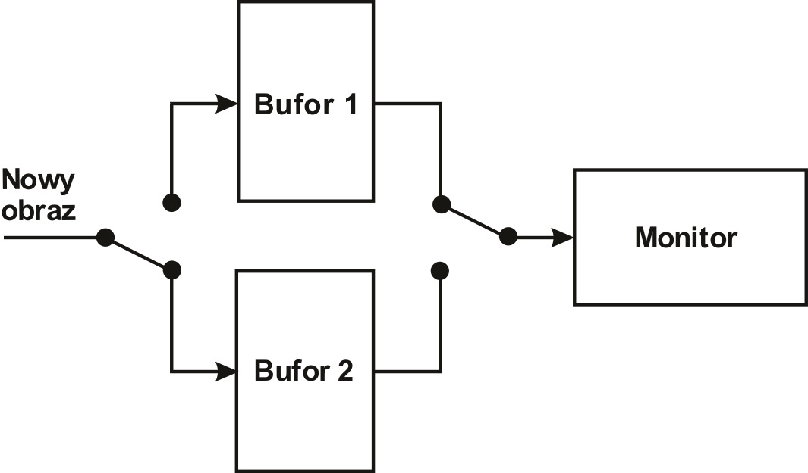
*wyświetlanie jednego obrazu w trakcie wprowadzania informacji do drugiego*
* percepcja ruchu:
  * < 10Hz - nieciągły ruch obiektów
  * < 25Hz - duże migotanie
  * \> 60-80Hz - brak migotania
* synchronizacja pionowa - jeżeli częstotliwość wyliczania kolejnego obrazu jest niższa niż częstotliwość wyświetlania obrazu, to obecny obraz wyświetlany jest jeszcze raz  

Problem zgodności percepcji obiektu przy obserwacji bezpośredniej i na ekranie monitora jest spowodowany nieliniowością monitora. Aby z nią walczyć, stosowana jest *korekcja gamma*, czyli zniekształcenie w celu skompensowania nieliniowości monitora.  
i = a^(1/γ) , gdzie typowo γ = 2,2  
Przed wykorzystaniem tekstury należy usunąć korekcję gamma, a obliczenia powinny być liniowe!

---

## Wykład 2
### Komórka LCD:
* 3 stany skupienia materii: stałe, ciekłe, gaz
* faza ciekłokrystaliczna - faza pośrednia między ciałem stałym a cieczą, możliwe skręcenie płaszczyzny polaryzacji światła

### Tranzystory TFT:
* technologia cienkowarstwowa
* wygodny sposób adresowania
* podtrzymanie napięcia na pikselu podczas skanowania reszty wyświetlacza

### Rozkład warstw monitora:
* Front polarizer 
* Front glass w/ color filters
* Liquid crystal layer
* Rear galss w/ TFT array and row/column drivers
* Rear polarizer
* Diffuser
* Fluorescent light backlight

### Monitor LCD (Liquid Crystal Display):
* 1920 x 1080
* 16:9
* czas reakcji matrycy ~2,5ms
* kontrast 1000:1

---

* kontrast statyczny - różnica między najjaśniejszym a najciemniejszym punktem statycznego obrazu
 
* kontrast dynamiczny - różnica między najjaśniejszym a najciemniejszym obrazem jaki można wygenerować

* TN (Twisted Nematic) - tanie, szybkie, słaba barwa, słaby kontrast, małe kąty widzenia, brak efektu smużenia

* VA (Vertically Aligned) - lepsza reprodukcja barw, lepszy kąt widzenia, trochę wolniejsze od TN, najlepszy kontrast, przesunięcie kolorów przy obserwacji pod kątem, dobra jakość czerni

* IPS (In-Plane Switching) - dobre odwzorowanie barw, szeroki kąt widzenia, dobry czas reakcji, słaba czerń

---

### Wyświetlacz OLED (Organic Light-Emitting Diode):
* dioda elektroluminescencyjna wytworzona ze związków organicznych:
* wyświetlacze graficzne:
  * zestawy diod RBGW
  * przy polaryzacji w kierunku przewodzenia

### Wyświetlacz AMOLED (Active-Matrix Oled):
* Zalety:
  * cienkie i elastyczne ekrany
  * dobra jasność i skala barw
  * brak podświetlenia - dobry kontrast i idealna czerń
  * czas reakcji ~0.01ms
  * kąt widzenia praktycznie nieograniczony
* Wady:
  * krótki czas życia 
  * podatność na wilgoć
  * efekt "wypalenia"

### Ekrany dotykowe:
* zasada działania - wykrycie faktu dotknięcia przez współrzędne x, y
* #### Ekrany rezystancyjne:
  * dwie warstwy metaliczne przewodzące prąd, normalnie oddzielone od siebie
  * dotknięcie powoduje styknięcie się warstw
  * pomiary napięć -> współrzędne x, y
  * najsłabsza jakość, najtańsze rozwiązanie, nieważne czym dotknięte
* #### Ekrany pojemnościowo-powierzchniowe:
  * jedna warstwa przewodząca na warstwie szklanej
  * jednorodne pole elektrostatyczne nad powierzchnią
  * dotknięcie palcem z drugiej strony warstwy szklanej powoduje zakłócenie pola
  * do każdego z narożników ekrany doprowadzone jest identyczne napięcie
  * pomiar prądów o wartościach proporcjonalnych od punktu dotknięcia -> współrzędne x, y
  * musi być dotknięcie przez palec
* #### Ekrany optyczne:
  * siatka z promieni podczerwieni

### Rasteryzacja odcinka:  
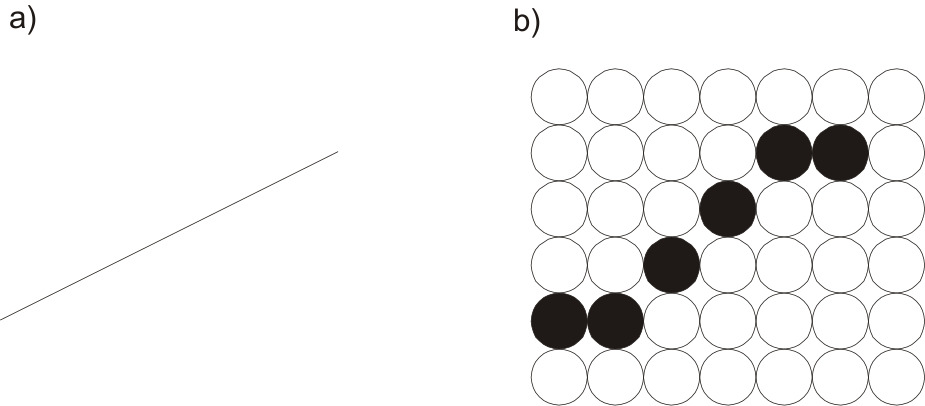  
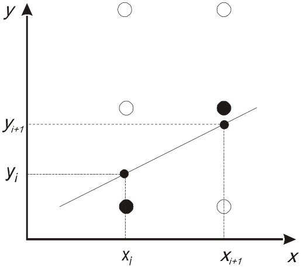  
```
y = mx + b
```

* #### Algorytm DDA
```
0 < m < 1, Δy = m,   
y(i+1) = y(i) + m
```
Przy kątach 45<α<90 wyznaczamy następny rząd, nie kolumnę.
* #### Algorytm Bresenhama
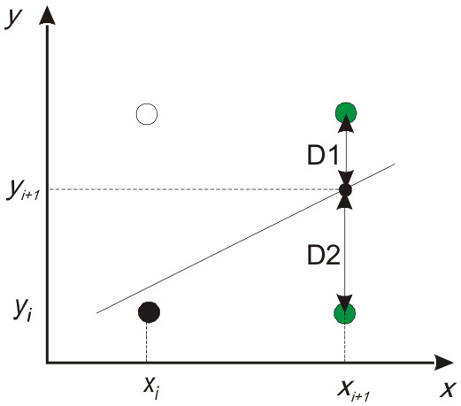  
```
1. 0 < m < 1, początek rysowania - lewy koniec odcinka  
2. Pomocnicze wielkości: Δx = x2 - x1, Δy = y2 - y1, a = 2Δy, b = 2Δy - 2Δx, p0 = 2Δy - Δx  
3. Dla kolejnych x(k) zaczynając od k = 0, sprawdzić znak p(k):  
	p(k) < 0 => następny piksel to ( x(k+1), y(k) ), a p(k+1) = p(k) + a  
	p(k) >= 0 => następny piksel to ( x(k+1), y(k+1) ), a p(k+1) = p(k) + b
```

### Aliasing:
* anty-aliasing - metoda dodatkowych pikseli -> dodawanie odcieni w pobliskich pikselach
* metoda dwóch pikseli w wierszu (kolumnie)
* metoda powierzchniowa (nadpróbkowanie)
* antyaliasing pełnoekranowy:
  * antyaliasing pełnoekranowy (FSAA - Full Screen Anti-Aliasing) - rendering z większą rozdzielczością (2x, 4x, ...), uśrednienie

### Rasteryzacja okręgu (metoda midpoint):  
* wystarczy wyznaczyć jeden oktant  
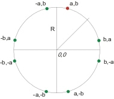  
* oktant do wyznaczenia:  
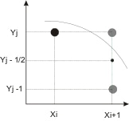  
```
1. Punkt początkowy (0, r), początkowa wartość parametru decyzyjnego p0 = 5/4 - r  
2. Dla kolejnych kolumn xk, zaczynając od k = 0, należy sprawdzić znak pk:  
	jeżeli pk < 0, następny piksel ma współrzędne (x(k+1), y(k)), a p(k+1) = pk + 2x(k+1) + 1  
	jeżeli pk >= 0, następny piksel ma współrzędne (x(k+1), y(k-1)), a p(k+1) = pk + 2x(k+1) + 1 - 2y(k+1)  
3. Wyznaczyć siedem pikseli o współrzędnych wynikających z symetrii okręgu
4. Powtarzać kroki 2 i 3 aż x = y
```

## Wykład 3
### Rasteryzacja: wypełnienie wnętrza  
* #### Metoda przeglądania wierszami (*scan line*):
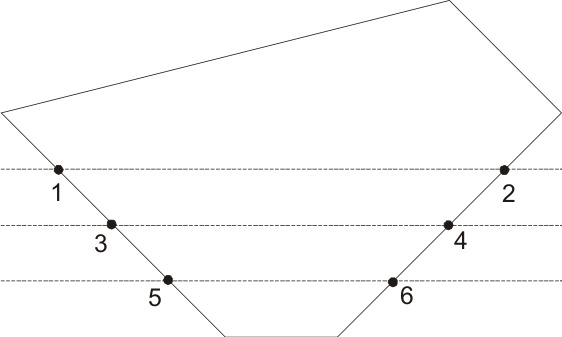  
*zakładamy, że znamy równania brzegów*
* #### Metoda z punktem początkowym (*seed*):
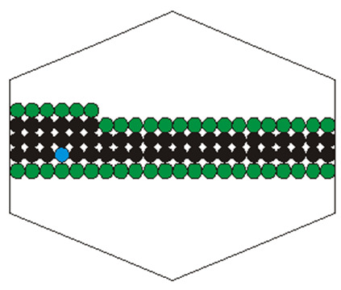  
  * Wypełnienie zaczyna się od znanego punktu wewnątrz figury. Idziemy w lewo, potem w prawo, następnie nad i pod punktem wierszami, dopóki nie natrafimy na brzeg.
  * Trzeba wskazać punkt początkowy
### Współrzędne barycentryczne:
* dla każdego U należącego do trójkąta ABC można jednoznacznie znaleźć wartości α, β, γ takie, że:
  * U = αA + βB + γC, 
  * α + β + γ = 1,
  * α, β, γ >= 0
> Przykład:  
>  Znaleźć współrzędne barycentryczne dla punktu U(2,2) w trójkącie o wierzchołkach A(1,2), B(2,3), C(5,1).  
> Na podstawie podanych danych można zapisać trzy następujące równania:  
> 2=α+2β+5γ  
> 2=2α+3β+γ  
> 1=α+β+γ  
> Po rozwiązaniu układu tych trzech równań otrzymujemy, że α = 3/5, β = 1/5, γ = 1/5
### Interpolacja w trójkącie (wypełnienie tonalne):
* znane wartości funkcji wierzchołków trójkąta
* znane współrzędne barycentryczne punktu U wewnątrz trójkąta
* wartość funkcji w punkcie U -> f(U) = αf(A) + βf(B) + γf(C)
* interpolacja barycentryczna wnętrza trójkąta na podstawie danych wierzchołkowych (koloru, normalnych innych atrybutów), np:
  * dla kolorów wierzchołkowych c0, c1, c2 kolor punktu o współrzędnych barycentrycznych α, β, γ jest równy c = αc0 + βc1 + γc2
### Rasteryzacja trójkąta:
* rysowanie pikseli, których środki należą do trójkąta (wszystkie współrzędne barycentryczne należą do przedziału (0, 1))
* gdy środek piksela leży na krawędzi dwóch trójkątów, można rysować krawędź o kolorze tego trójkąta, w którym wierzchołek, który nie leży na krawędzi, leży po tej samej stronie co jakiś punktu spoza ekranu (np, (-1, -1))
### Obcinanie:
* wyznaczanie fragmentu obiektu (odcinka, wielokąta, itp.), który leży wewnątrz okna (np. dowolnego wielokąta)
* #### Algorytm obcinania odcinków Cohena-Sutherlanda:
  * skuteczność niestuprocentowa, ale algorytm stosowany ze względu na prostotę
  * fazy algorytmu:
    * podział płaszczyzny na podobszary i przypisanie kodów (binarnych)  
 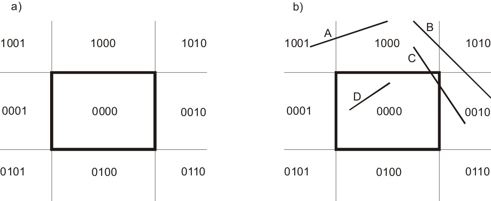
    * (I faza) wstępna eliminacja odcinków    
    Jeżeli iloczyn logiczny kodów obu końców odcinka, przypisane wg kodu podobszaru, w którym się znajdują, jest różny od 0, odcinek jest eliminowany
    * (II faza) obcinanie właściwe  
  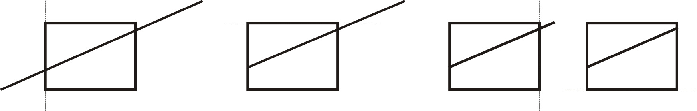
 * #### Algorytm obcinania wielokątów Sutherlanda-Hodgmana:
   * tworzona jest lista zapamiętywanych wierzchołków części wspólnej wielokąta i rozpatrywanej półpłaszczyzny
   * idąc kolejno po wierzchołkach wielokąta, oznaczając obecny wierzchołek S, a następny jako N:
     * jeżeli oba wierzchołki są wewnątrz, na listę wpisywany tylko punkt N,
     * jeżeli oba wierzchołki są na zewnątrz, na listę nie jest wpisywany żaden,
     * jeżeli S jest na zewnątrz, a N wewnątrz, zapamiętywany jest punkt P - punkt przecięcia SN z granicą rozpatrywanej półpłaszczyzny 
     * jeżeli N jest na zewnątrz, a S wewnątrz, zapamiętywany jest punkt przecięcia P, a następnie N  
     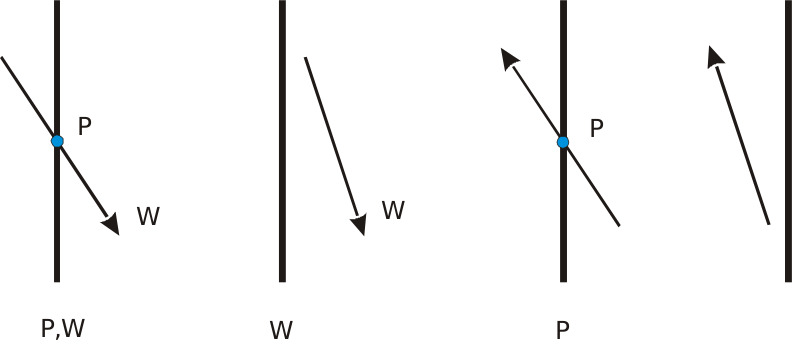
 
### Barwy w grafice komputerowej

* zakres widzialny - 380nm-780nm
  * 300 - ultrafiolet
  * 400 - fiolet
  * 500 - niebieski/zielony
  * 600 - żółty
  * 700 - pomarańczowy/czerwony
  * 800 - podczerwień
* wrażenie związane z barwą jest czysto percepcyjne, nie fizyczne
* zależność percepcji barwy od długości fali
* określona barwa może być wytworzona przez rożne kombinacje składowych widmowych - tzw. metamery (np. kombinacja fal 610nm i 540nm utworzy falę 575nm)

### Charakteryzowanie koloru:
* teoria trójchromatyczna (na bazie prawa Grassmana) - 3 kolory podstawowe wystarczają do wyświetlenia kolorów percepcyjnych; odpowiednio ważone kombinacje kolorów podstawowych tworzą metamery dla kolorów percepcyjnych
* teoria barw przeciwstawnych - kodowanie barw za pomocą 3 przeciwstawnych składowych: 
  * R-G (Red-Green)
  * B-Y (Blue-Yellow)
  * K-W (blacK-White)
* opis oparty na trzech właściwościach percepcji obrazu:
  * odcień barwy (H - Hue)
  * jasność (V - Value)
  * nasycenie (S - Saturation)

### Skala szarości:
* Przeciętny obserwator umie rozróżnić około 100 odcieni barw
* 256 uznana jako dostatecznie duża liczba odcieni

## Wykład 4

### Model RGB:  
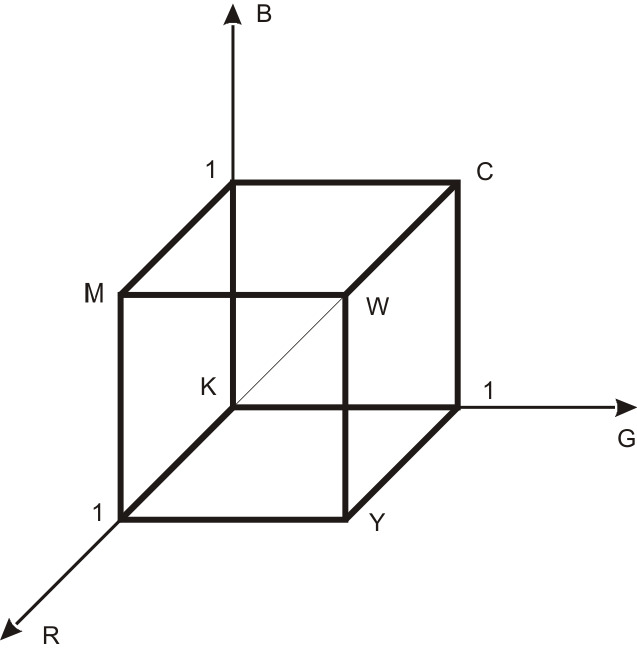  
* model dyskretny - skończona ilość barw
* 2^24 barw modelu
* nie reprezentuje wszystkich barw widzialnych
* addytywny system kolorów

### Model CMY:  
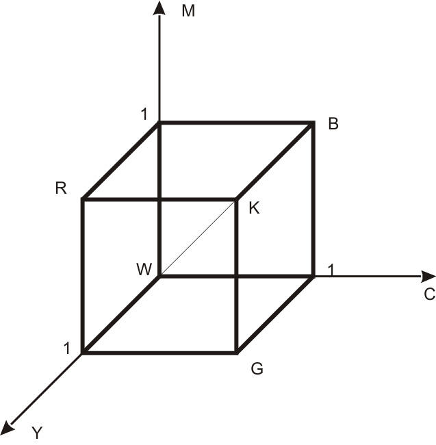  
* model dyskretny
* nie reprezentuje wszystkich barw widzialnych
* przydany w drukarstwie
* subtraktywny system kolorów

### Model CMYK:
* CMY + blacK

### Model HSV:  
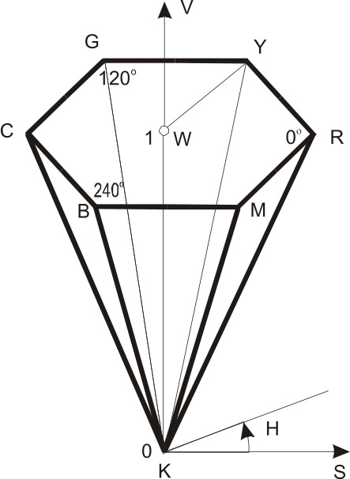  
* oparty na barwie, nasyceniu i jasności:
  * Hue - odcień barwy wyrażany w stopniach
  * Saturation - nasycenie w skali 0-1, lub w procentach
  * Value - wartość, gdzie 0 to czerń, 1 to biel

### Model HLS:
* L - Lightness

### Model CIE XYZ  
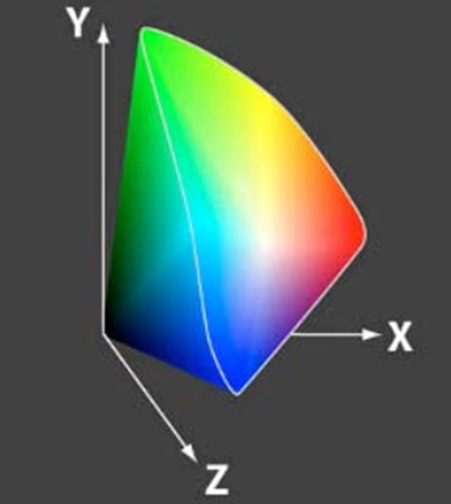  
* X, Y, Z - 3 barwy zdefiniowane matematycznie, nie mające rzeczywistych odpowiedników
* X+Y+Z - sumaryczna energia światła
* normalizacja: 
  * x = X / (X+Y+Z)
  * y = Y / (X+Y+Z)
  * z = Z / (X+Y+Z)
* do reprezentowania barwy starczą x i y, w razie potrzeby dodawany jest Y (iluminacja)
* reprezentuje wszystkie barwy widzialne

### Wykres chromatyczności:  
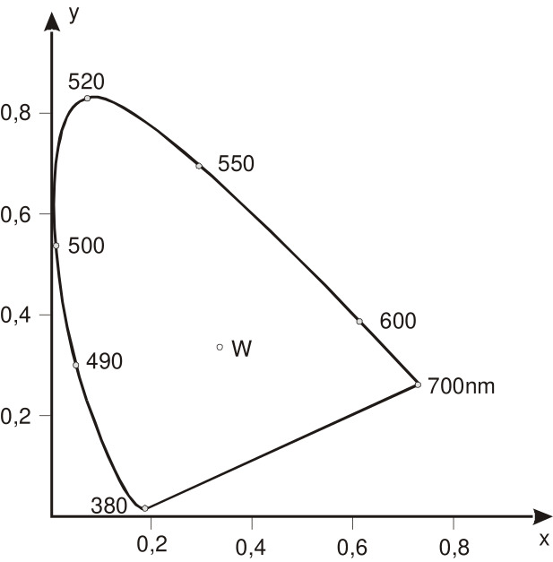  
* wszystkie barwy widzialne z dokładnością do jasności
* zbiór punktów (x, y) reprezentujących barwy widma widzialnego
* jeżeli wybierzemy 2 punktu na wykresie i je pomieszamy, dostaniemy kolor o współrzędnych leżących na odcinku między nimi
* jeżeli pomieszamy 3 barwy, to wynikowy kolor będzie wewnątrz trójkąta stworzonego przez punktu 
* niektóre barwy widzialne nie leżą wewnątrz trójkąta R, G, B, dlatego nie da się ich wyświetlić

--- 

* biel D65 (biel 6500) - barwa ciała doskonale czarnego, ogrzanego do 6500K; biel używana w grafice

### Reprodukcja obrazów barwnych:
* wspólna część gamutów - za mało barw, słabe rozwiązanie
* system zarządzania kolorami (CMS) - stosowane na co dzień
* standaryzacja modelu barw (sRGB, Adobe RGB) - też na co dzień (gamma=2,2)

### CMS:
* reprezentacja koloru niezależna od urządzenia: CIE XYZ albo CIE LAB
* dla każdego urządzenia określany jest profil (w postaci LUT), umożliwiający odwzorowanie przestrzeni kolorów urządzenia na przestrzeń niezależną od urządzenia

### sRGB (standard RGB):
* standard dla zastosowań w różnych urządzeniach
* HP i Microsoft
* R, G, B będą wszędzie takie same

### Adobe RGB
* Adobe 👍

### Kolory przeciwstawne:
* R-G, Y-B, achromatyczna iluminacja
* R-G na jednej osi, R-dodatnie, G-ujemne; tak samo Y-B

### Dithering (rozproszenie):
* metoda tworzenia wrażenia głębi koloru przy ograniczonej palecie
* kolory niedostępne w palecie są przybliżone na zasadzie mieszania barw z dostępnej palety
* algorytmy ditheringu - używane tylko dla barwy białej i czarnej
  * progowanie - piksele jaśniejsze dostają jedną wartość, ciemniejsze drugą
  * losowe progowanie
  * półtony
  * Floyd-Steinberg
  * Atkinson

* #### Półtony (mikrowzory):
  * cyfrowa reprodukcja klasycznych półtonów
  * realizacja odcieni szarości za pomocą mikrowzorów; liczba czarnych pikseli określa odcień szarości wzoru
  * należy unikać artefaktów

* #### Algorytmy dyfuzyjne:
  * wyznaczenie różnicy między wartością piksela a najbliższą dostępną (?)
  * rozproszenie różnicy między sąsiednimi pikselami (jeszcze nie przetworzone)
  * różne wzory rozpraszania (filtry):
    * Floyd-Steinberg - prób ustalony na poziomie 50% skali szarości
    * Atkinson - próg na poziomie 50% skali szarości, dystrybucja 3/4 błędu

### Przekształcenia geometryczne na płaszczyźnie:
* #### Translacja (przesunięcie):
```
x' = x + Tx  
y' = y + Ty  
```
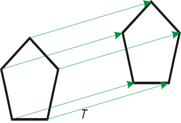  

* #### Skalowanie:
Względem punktu (0,0)  
```
x' = x * Sx  
y' = y * Sy   
```
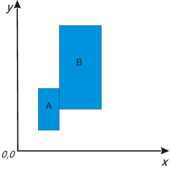  
Względem punktu (1,1) (xf, yf - punkty odniesienia)
```
x' = x * Sx + xf(1 - Sx)  
y' = y * Sy + yf(1 - Sy)  
```
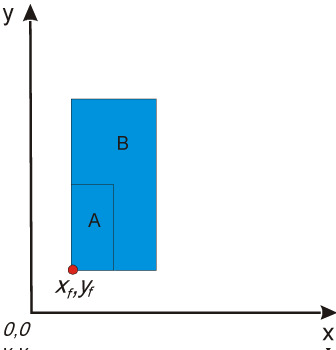  
* #### Obrót:
Względem punktu (0,0)
```
x′ = xcosθ − ysinθ  
y′ = xsinθ + ycosθ  
```
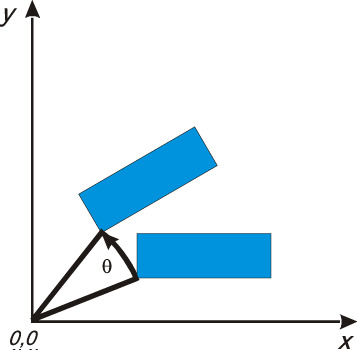  
Względem punktu (xr, yr) 
``` 
x′ = xr + (x − xr) * cosθ − (y − yr) * sinθ  
y′ = yr + (x − xr) * sinθ + (y − yr) * cosθ   
```
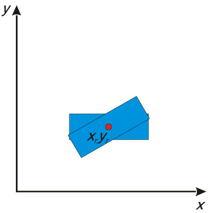

* #### Pochylanie
Wzdłuż osi X  
```
x′ = x + ay  
y′ = y  
```
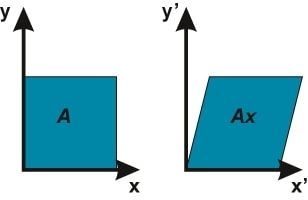  
Wzdłuż osi Y  
```
x′ = x  
y′ = bx + y  
```
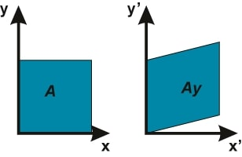  

### Współrzędne jednorodne:
* umożliwia jednorodny zapis podstawowych przekształceń geometrycznych
* ułatwia realizację obliczeń i je przyspiesza
  * Przekształcenie ogólne:  
 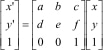  

  * *Przesunięcie* o wektor Tx, Ty  
  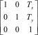  

  * *Skalowanie* Sx, Sy  
  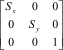  

  * *Obrót* o kąt θ  
  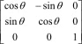  

  * *Pochylenie* wzdłuż osi X ze współczynnikiem a  
  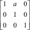  

  * *Pochylenie* wzdłuż Y ze współczynnikiem b  
  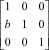  

* macierze można przez siebie wymnażać w celu uzyskania macierzy przekształcenia złożonego


